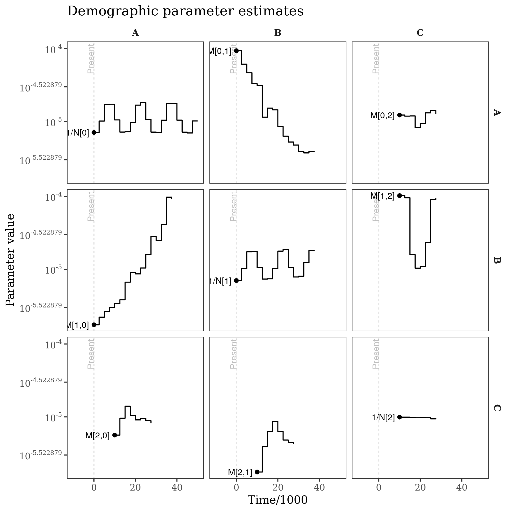
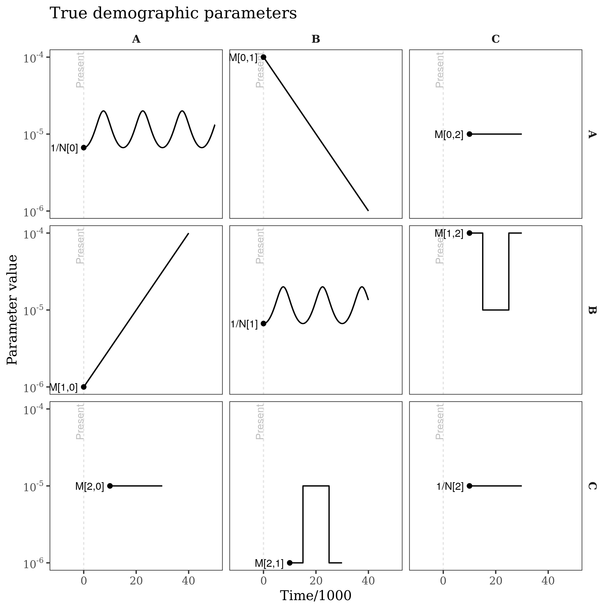
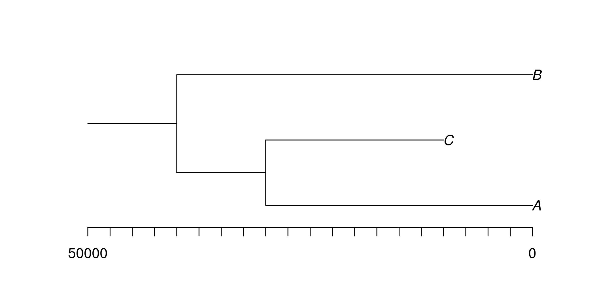
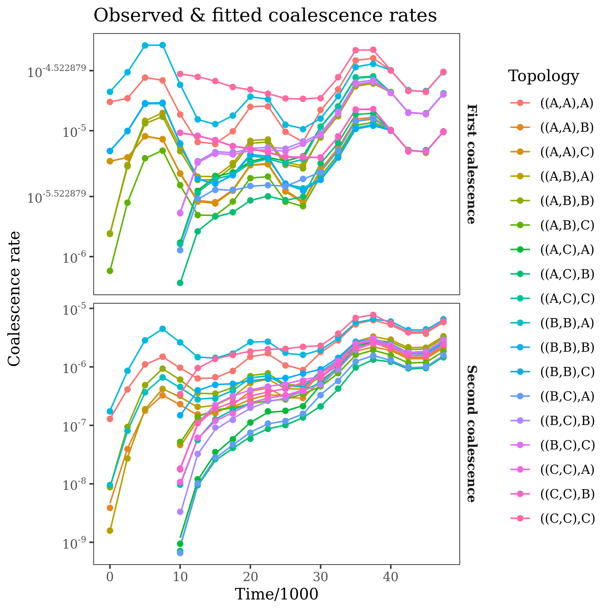
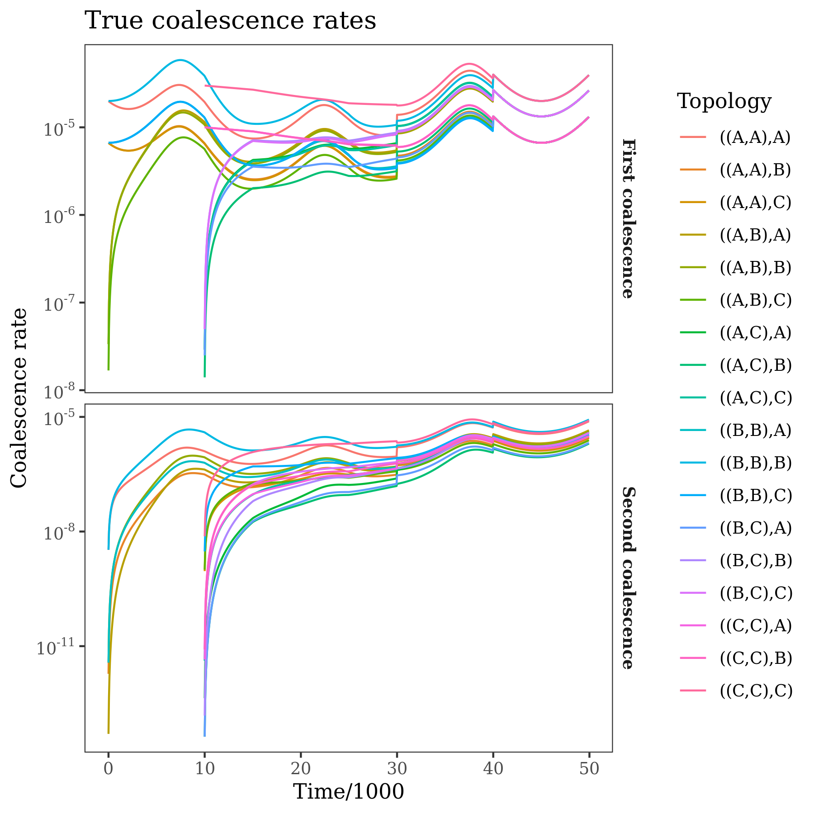
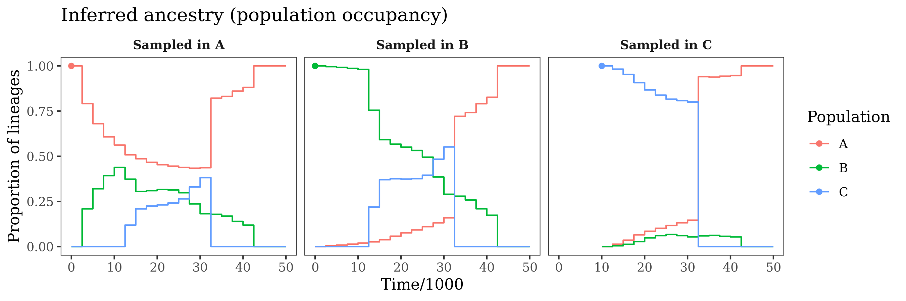
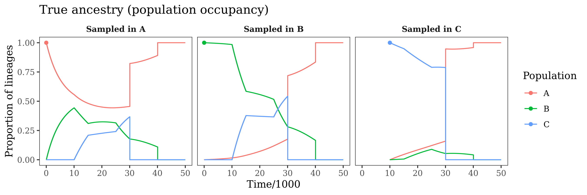

# coaldecoder

An R package for demographic inference for multi-population models from
reconstructed genealogies using trio coalescence rates. The method allows
estimation of time-varying (asymmetric) migration rate and effective population
sizes, and scales to thousands of epochs and tens of populations. Note that
this package is at a 'proof of concept' stage, the API and implementation are
bound to change. 

The underlying model and input statistics are similar to those described in
[this poster](inst/example/Pope_ProbGen2022.pdf), although the method now uses
both first and second coalescence events from each trio, and allows population
mergers and ancient samples.

### Tutorial
```r
library(coaldecoder)
reticulate::source_python(system.file("python", "calculate_rates.py", package = "coaldecoder"))

# use msprime to simulate an example tree sequence, this can takes a couple minutes
source(system.file("example", "simulate_example.R", package = "coaldecoder"))

# calculate "observed" trio coalescence rates within twenty-five 2500-generation epochs
time_breaks <- seq(0, 50000, 2500)
sample_sets <- list( #sample indices in the tree sequence for each population
  "A" = c(0:9), 
  "B" = c(10:19), 
  "C" = c(20:29)
)
obs_rates <- ObservedTrioRates(
  ts = "coaldecoder_example.ts", 
  sample_sets = sample_sets, 
  time_breaks = time_breaks,
  bootstrap_blocks = 1000,
  mask = NULL,
  threads = 1 #currently ignored
)

# extract rates and bootstrap precision
rates <- obs_rates$rates()
rates_sd <- obs_rates$std_dev(num_replicates=1000, random_seed=1)
precision <- smoothed_bootstrap_precision(mean=rates, sd=rates_sd)
rownames(rates) <- rownames(precision) <- obs_rates$emission_states()
colnames(rates) <- colnames(precision) <- obs_rates$epochs()

# set up simple population tree (encoded as a Newick string)
# where population "C" is sampled at 10000 generations in the past
pop_tree <- PopulationTree$new("((A:30000,C:20000):10000,B:40000);", time_breaks=time_breaks)
pop_tree$plot_population_tree()
# mergers are reverse alphabetical, e.g. here "C" merges into "A" at time 30000

# estimate demographic parameters (e.g. Ne and migration rate trajectories)
# for each epoch given the constraints of the population tree
fit <- coaldecoder(
  coalescence_rates=rates,
  bootstrap_precision=precision,
  epoch_durations=pop_tree$epoch_durations(),
  demographic_parameters=pop_tree$demographic_parameters(), #starting values
  admixture_coefficients=pop_tree$admixture_coefficients(),
  penalty=matrix(3, 3, 3) #smoothing penalty
)

# update model with fitted parameters and plot estimates
pop_tree$set_demographic_parameters(fit$demographic_parameters)
pop_tree$plot_demographic_parameters(time_scale=1000) + 
  ggtitle("Demographic parameter estimates") 
pop_tree$plot_expected_coalescence_rates(observed=rates, time_scale=1000, log_transform=TRUE) + 
  ggtitle("Observed & fitted coalescence rates")
pop_tree$plot_occupancy_probabilities(time_scale=1000) +
  ggtitle("Inferred ancestry (population occupancy)")
```
This produces plots of estimated demographic parameters, fitted coalescence rates, and the ancestry of lineages
from the various populations through time. In the following, the estimated quantities are plotted alongside the
truth (e.g. the model used for the simulation).

#### Tutorial: demographic parameter estimates
Each panel is the estimated trajectory for a demographic parameter, between the
time it was sampled (point) and the time it merges with another population or
hits the last epoch. Migration rates are on the offdiagonal, and **inverse** effective
population sizes are on the diagonal (inverse so that the y-scale is consistent across panels). 

<p align="center">


</p>

The "gaps" in the demographic parameter estimates reflect when populations
are/are not extant, e.g. which is made clear by the population tree:

<p align="center">

</p>

#### Tutorial: fitted coalescence rates
The panels show coalescence rates for the first and second coalescence events of a trio with a given population labelling.
These rates are the "raw data" used by the method, and are calculated directly from the input tree sequence. The
points are the observations, the lines are the expected rates under the fitted demographic model.
<p align="center">


</p>

#### Tutorial: ancestry proportions
The panels show ancestry probabilities throughout time for genomes sampled in each of the populations. These are the
probability that a randomly selected site in the genome was in a given population at a given time in the past. For example,
in the first panel, a genome sampled from population "A" is in population "A" at the present day (obviously). Moving into the
past, the probability that a lineage from this genome remains in "A" decreases, due to migration. This continues until the population
mergers, where "B" and "C" merging into "A" ensure that the lineage ultimately returns to "A" at some point in the past.
<p align="center">

</p>
<p align="center">

</p>

### Installation
Install dependencies:

__python__
- tskit (>=0.4.0)
- msprime (>=1.0.0)
- numpy
- scipy

__R__
- reticulate
- RcppArmadillo (>=0.10.6.0.0)
- numDeriv (optional, for Hessian)
- ggplot2 (optional, for plots)
- dplyr (optional, for plots)
- pammtools (optional, for plots)

Then install via:
```r
remotes::install_github("nspope/coaldecoder")
```

### Population tree specification examples
TODO

### Rate estimation
TODO

### Low-level interface

The efficient likelihood/gradient calculations in `coaldecoder` may be 
useful for implementing more complex models (or for use with more sophisticated
optimizers). The lower-level interface is a C++ class exposed as a reference
class via `Rcpp`'s modules framework.

TODO


### Cross-validation and estimation of smoothing penalties

TODO

### Cross-validation and model selection

TODO
