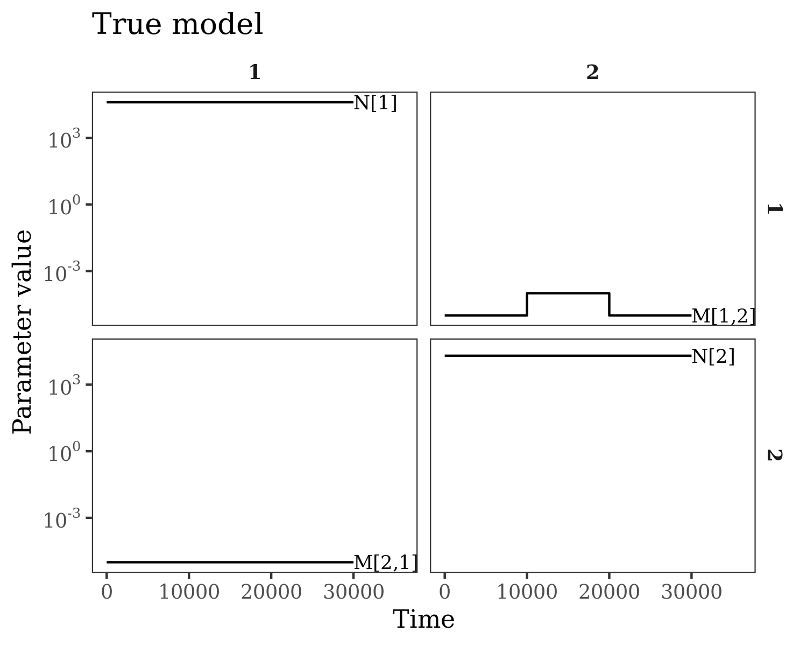
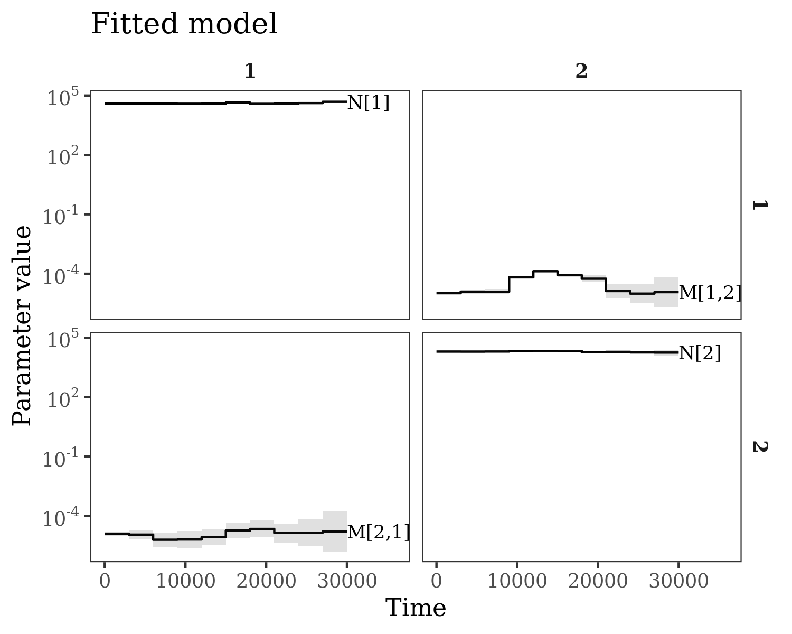

# coaldecoder

An R package for demographic inference for multi-population models from
reconstructed genealogies using trio coalescence rates. The method allows
estimation of (asymmetric) migration rates and effective population sizes, and
scales to thousands of epochs and tens of populations. Note that this package
is at a 'proof of concept' stage, the API and implementation are bound to
change. The underlying model and input statistics are described in [this
poster](inst/example/Pope_ProbGen2022.pdf). 

### Known issues

- Currently the rate calculation will abort when there are completely missing intervals in tree sequences (e.g. masked regions).
- When the model is overdetermined (more populations in model than are actually present) then the parameter estimates become biased. This can be solved by including population mergers (see 'Population mergers and parameter identifiability' section).
- If any of the epochs contain/go beyond the TMRCA of the tree sequence, then the associated trio rates are undefined (are `NaN`s). This isn't gracefully handled at the moment.

### Dependencies

__python__
- tskit (>=0.4.0)
- numpy

__R__
- RcppArmadillo (>=0.10.6.0.0)
- numDeriv (optional, for Hessian)
- ggplot2 (optional, for plots)
- dplyr (optional, for plots)
- pammtools (optional, for plots)

### Minimal example

For example inputs, simulate from a two-population demographic history using `msprime` in python,
writing the simulated tree sequences out to the native binary format of `tskit`:
```python
import msprime

populations = [
  msprime.PopulationConfiguration(sample_size=20, initial_size=20000),
  msprime.PopulationConfiguration(sample_size=20, initial_size=10000)
]

demography = [
  msprime.MigrationRateChange(time=0, rate=1e-5),
  msprime.MigrationRateChange(time=10000, rate=1e-4, matrix_index=(0,1)),
  msprime.MigrationRateChange(time=20000, rate=1e-5, matrix_index=(0,1)),
  msprime.MassMigration(time=30000, source=1, dest=0)
]

ts_gen = msprime.simulate(
  population_configurations=populations,
  demographic_events=demography,
  Ne=20000,
  recombination_rate=1e-8,
  length=10e6,
  num_replicates=10,
  random_seed=1024
)

for i,ts in enumerate(ts_gen):
  ts.dump('coaldecoder_example_' + str(i) + '.ts')
```
Here, we've generated 10 replicate tree sequences (e.g. chromosomes), each 10 Mb long and containing genealogies for 20 haploids per population.

In R, first we calculate trio coalescence rates. We generate 100 bootstrap replicates by resampling 100 contiguous blocks of trees, and combine rates across the replicate tree sequences. To do this, we need paths to the binary tree sequences, as well as (0-based) indices mapping samples to populations. We also need a time discretization, so we'll use ten 3000-generation epochs.
```r
library(coaldecoder)
rates <- calculate_rates(
  ts_paths = list.files(pattern="coaldecoder_example.+ts"),
  sample_sets = list("A"=c(1:20)-1,"B"=c(21:40)-1),
  time_breaks = seq(0, 30000, 3000),
  bootstrap_replicates = 100,
  bootstrap_blocks = 100,
  random_seed = 1024,
  merge_ts = TRUE
)
```

Next we need to estimate a precision matrix for the rates from the bootstrap replicates. This is necessary to provide the model with information about the expected variance of the rates. In general, if there are a lot of rate statistics (e.g. many populations/epochs) then an enormous number of bootstrap replicates will be needed to get a full-rank precision matrix with low error. So, we'll calculate a full-rank approximation instead. The simplest full-rank approximation is a diagonal precision matrix, but this ignores dependence between rates within/across epochs. A better approach is to calculate a shrinkage estimator, for example:
```r
prec_mat <- matrix(0, length(rates$y), length(rates$y))
nonzeros <- as.vector(rates$y > 0)
prec_mat[nonzeros,nonzeros] <- corpcor::invcov.shrink(t(rates$y_boot[nonzeros,]))
```
Some of the rates are 0 by design, so these have nil precision.


Then we need to set up the model, which requires an array of demographic parameters with dimensions `(# populations, # populations, # epochs)` and the durations of the epochs in generations. The parameterization used is identical to that of `msprime`.
```r
# starting values for optimization
demographic_params <- array(NA, c(2, 2, 10))
demographic_params[1,1,] <- demographic_params[2,2,] <- 5000
demographic_params[1,2,] <- demographic_params[2,1,] <- 1e-6
epoch_durations <- rep(3000, 10)
```


Finally, we can fit the model:
```r
fitted_model <- coaldecoder(
  rates$y,
  prec_mat,
  demographic_params,
  epoch_durations,
  penalty = matrix(1, 2, 2),
  calculate_hessian = TRUE
)
```
Here we've specified a smoothing penalty of 1 on the squared differences between log10 parameter values from adjacent epochs. When epochs are numerous (temporal resolution is fine), the penalty will have an enormous impact on the fit, and so it's a good idea to use cross-validation to choose the degree of penalization. That could be done using a holdout set of chromosomes, but we skip that here as the temporal resolution is rather coarse.

`coaldecoder()` returns an object identical in structure to the output of R's `optim()`, so see `?optim` for details. What is relevant here is,
```r
str(fitted_model$par) # log10 optimized demographic parameters
str(fitted_model$hessian) # Hessian matrix, if requested
```

To visualise the fitted model, use:
```r
plot_demographic_model(
  10^fitted_model$par,
  epoch_durations,
  fitted_model$hessian #optional
) + ggtitle("Fitted model")
```
Each panel is an element of the parameter matrix; e.g. the diagonal panels are effective population sizes, and panel (1, 2) is the backwards-in-time migration rate from population 2 into population 1.

Let's compare these estimates to the true model. `msprime` uses diploid
effective population size by default, while `coaldecoder` returns haploid effective
population sizes, so we need to scale appropriately.
```r
true_model <- array(NA, dim=c(2,2,3))
true_model[1,1,] <- 20000 * 2
true_model[2,2,] <- 10000 * 2
true_model[1,2,] <- c(1e-5, 1e-4, 1e-5)
true_model[2,1,] <- c(1e-5, 1e-5, 1e-5)
true_durations <- c(10000, 10000, 10000)
plot_demographic_model(
  true_model,
  true_durations
) + ggtitle("True model")
```

The fitted model accurately captures the "bump" in migration from 2 to 1:
<p align="center">

&nbsp; &nbsp; &nbsp; &nbsp;

</p>

### Low-level interface

The efficient likelihood/gradient calculations in `coaldecoder` may be 
useful for implementing more complex models (or for use with more sophisticated
optimizers). The lower-level interface is a C++ class exposed as a reference
class via `Rcpp`'s modules framework.

### Population mergers and identifiability

TODO

### Cross-validation

TODO
