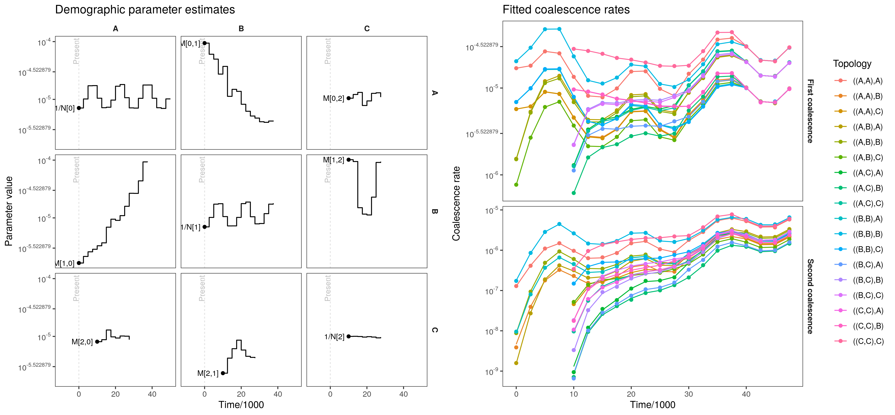
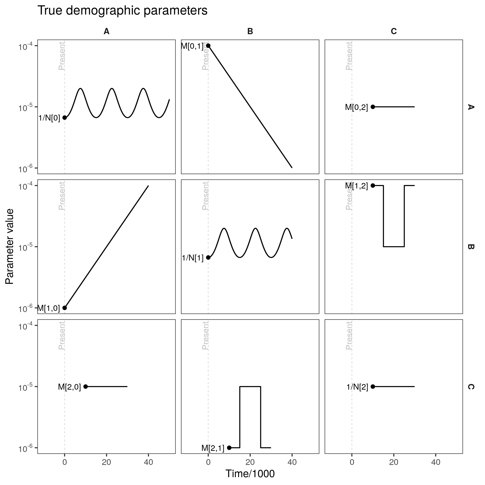

# coaldecoder

An R package for demographic inference for multi-population models from
reconstructed genealogies using trio coalescence rates. The method allows
estimation of time-varying (asymmetric) migration rate and effective population
sizes, and scales to thousands of epochs and tens of populations. Note that
this package is at a 'proof of concept' stage, the API and implementation are
bound to change. 

The underlying model and input statistics are similar to those described in
[this poster](inst/example/Pope_ProbGen2022.pdf), although the method now uses
both first and second coalescence events from each trio, and allows population
mergers and ancient samples.

### Quick start
```r
library(coaldecoder)
reticulate::source_python(system.file("python", "calculate_rates.py", package = "coaldecoder"))

# use msprime to simulate an example tree sequence, this can takes a couple minutes
source(system.file("example", "simulate_example.R", package = "coaldecoder"))

# calculate "observed" trio coalescence rates within twenty-five 2500-generation epochs
time_breaks <- seq(0, 50000, 2500)
sample_sets <- list( #sample indices in the tree sequence for each population
  "A" = c(0:9), 
  "B" = c(10:19), 
  "C" = c(20:29)
)
obs_rates <- ObservedTrioRates(
  ts = "coaldecoder_example.ts", 
  sample_sets = sample_sets, 
  time_breaks = time_breaks,
  bootstrap_replicates = 1000,
  bootstrap_blocks = 1000,
  random_seed = 1,
  mask = NULL,
  threads = 1 #currently ignored
)

# extract rates and bootstraps from calculator
rates <- obs_rates$rates()
boot_rates <- obs_rates$bootstrapped_rates()
rownames(boot_rates) <- rownames(rates) <- obs_rates$emission_states()

# set up simple population tree (encoded as a Newick string)
# where population "C" is sampled at 10000 generations in the past
pop_tree <- PopulationTree$new("((A:30000,C:20000):10000,B:40000);", time_breaks=time_breaks)
pop_tree$plot_population_tree()

# estimate demographic parameters (e.g. Ne and migration rate trajectories)
# for each epoch given the constraints of the population tree
fit <- coaldecoder(
  coalescence_rates=rates,
  bootstrap_coalescence_rates=boot_rates,
  epoch_durations=pop_tree$epoch_durations(),
  demographic_parameters=pop_tree$demographic_parameters(), #starting values
  admixture_coefficients=pop_tree$admixture_coefficients(),
  penalty=matrix(3, 3, 3) #smoothing penalty
)

# update model with fitted parameters and plot estimates
pop_tree$set_demographic_parameters(fit$demographic_parameters)
pop_tree$plot_demographic_parameters(time_scale=1000) + 
  ggtitle("Demographic parameter estimates") -> model_plot
pop_tree$plot_expected_coalescence_rates(observed=rates, time_scale=1000, log_transform=TRUE) + 
  ggtitle("Fitted coalescence rates") -> rates_plot
```
This produces plots of estimated demographic parameters (left), and fitted coalescence rates (right).
Each panel of the left plot is the estimated trajectory for a demographic parameter. **Inverse** effective
population sizes are on the diagonal; migration rates are on the offdiagonal. The panels of the right plot
are coalescence rates for the first and second coalescence events of a trio with a given population labelling.
These rates are the "raw data" used by the method, and are calculated directly from the input tree sequence. The
points are the observations, the lines are the expected rates under the fitted demographic model.
<p align="center">

</p>

Compare to the (goofy-looking) **true** demographic parameters (e.g. used to simulate data):
<p align="center">

</p>

### Installation
Install dependencies:

__python__
- tskit (>=0.4.0)
- msprime
- numpy
- scipy

__R__
- reticulate
- RcppArmadillo (>=0.10.6.0.0)
- corpcor (optional, for non-diagonal bootstrap covariance matrices)
- numDeriv (optional, for Hessian)
- ggplot2 (optional, for plots)
- dplyr (optional, for plots)
- pammtools (optional, for plots)

Then install via:
```r
remotes::install_github("nspope/coaldecoder")
```

### Population tree specification examples
TODO

### Rate estimation
TODO

### Low-level interface

The efficient likelihood/gradient calculations in `coaldecoder` may be 
useful for implementing more complex models (or for use with more sophisticated
optimizers). The lower-level interface is a C++ class exposed as a reference
class via `Rcpp`'s modules framework.

TODO


### Cross-validation and estimation of smoothing penalties

TODO

### Cross-validation and model selection

TODO
